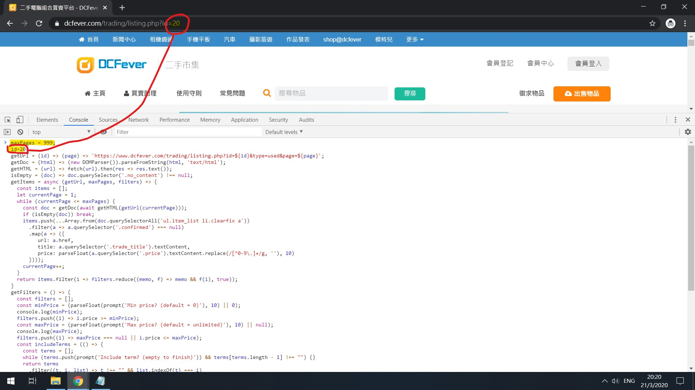
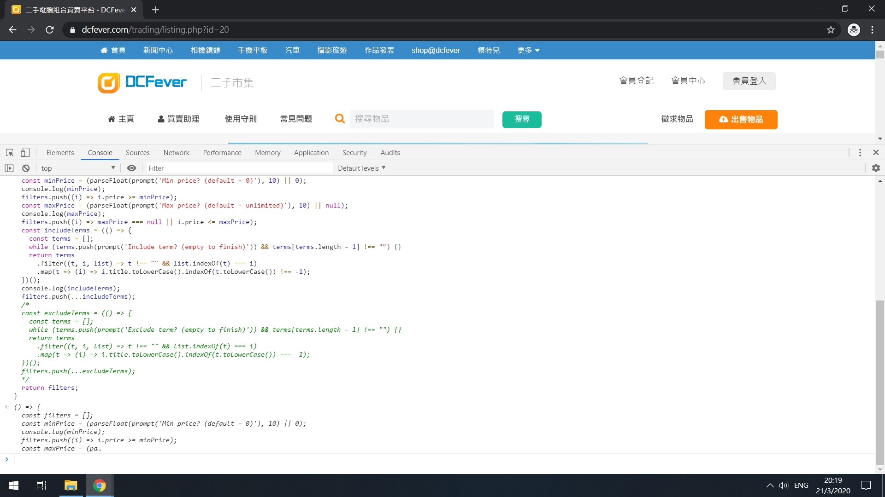
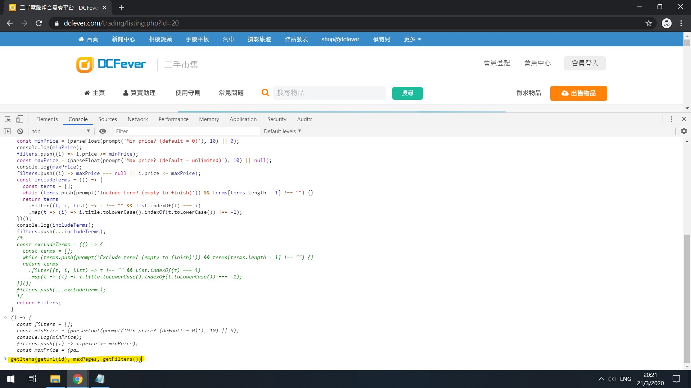
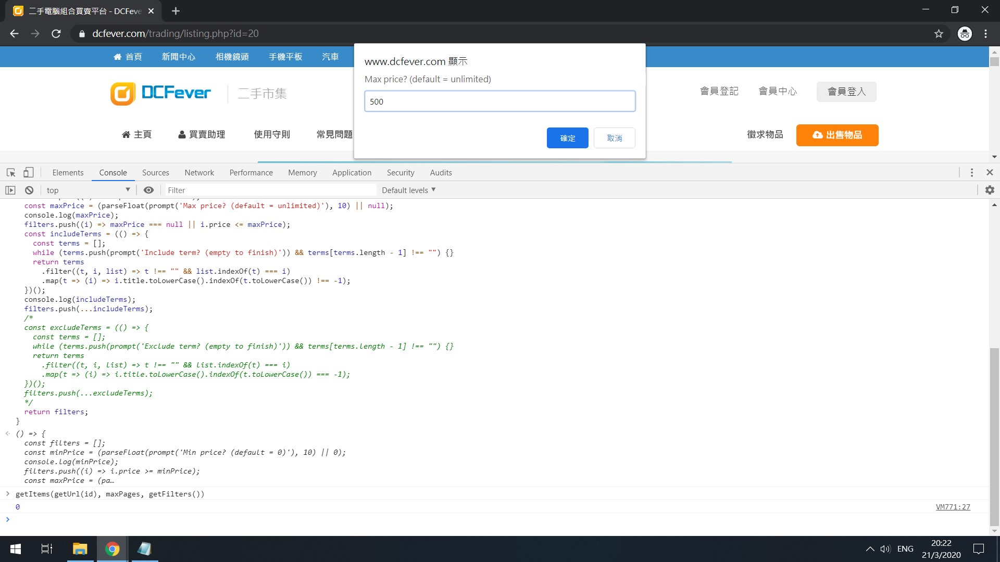
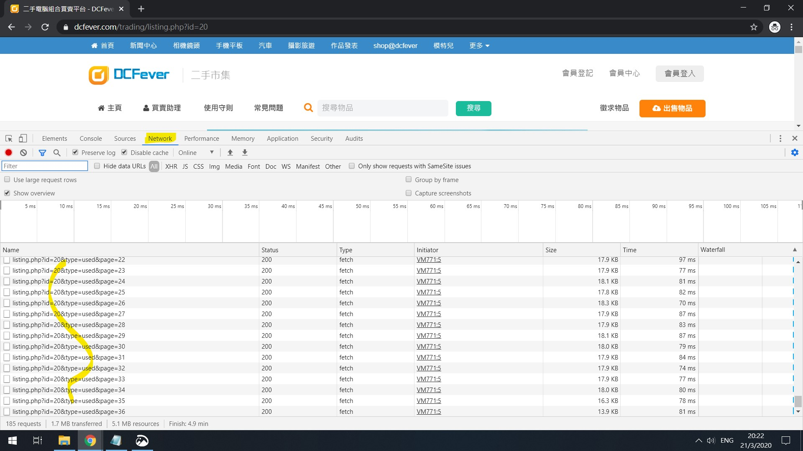
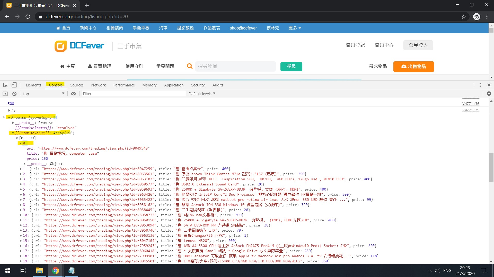
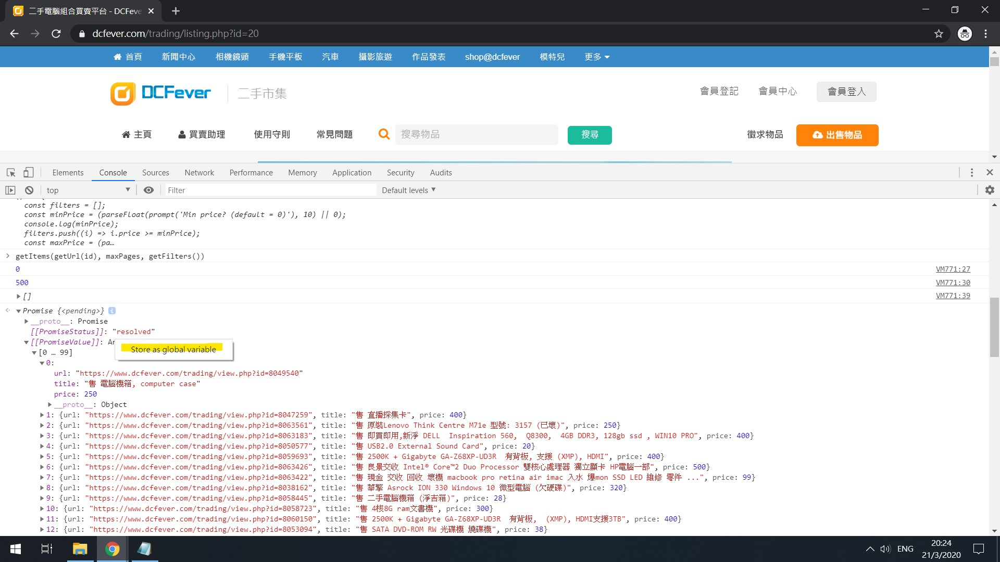
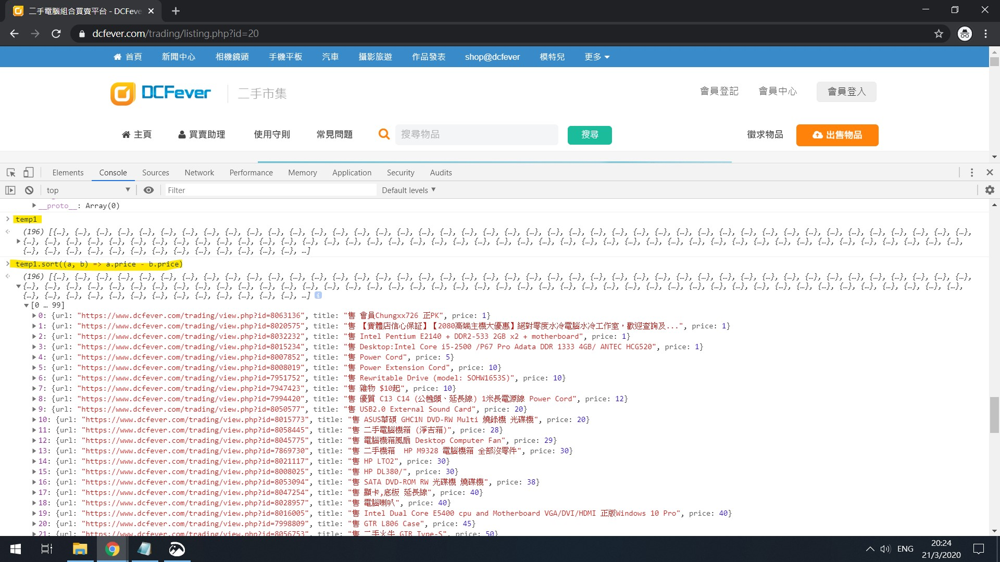

# DCFilter
DCFever二手區窮撚恩物

## 點用

用Google Chrome入[DCFever二手區](https://www.dcfever.com/trading/index.php)

禁F12開Chrome DevTool

用Notepad打開[index.js](./index.js), 複製貼上DevTool個Console度

id咩區就set咩number

禁Enter

入highlight左果段command

問你咩就答咩

去Network tab睇load完未

等到佢唔郁

番去Console tab

禁開個Promise睇結果

跟住要跟價錢排番

儲做global variable先

sort條array

